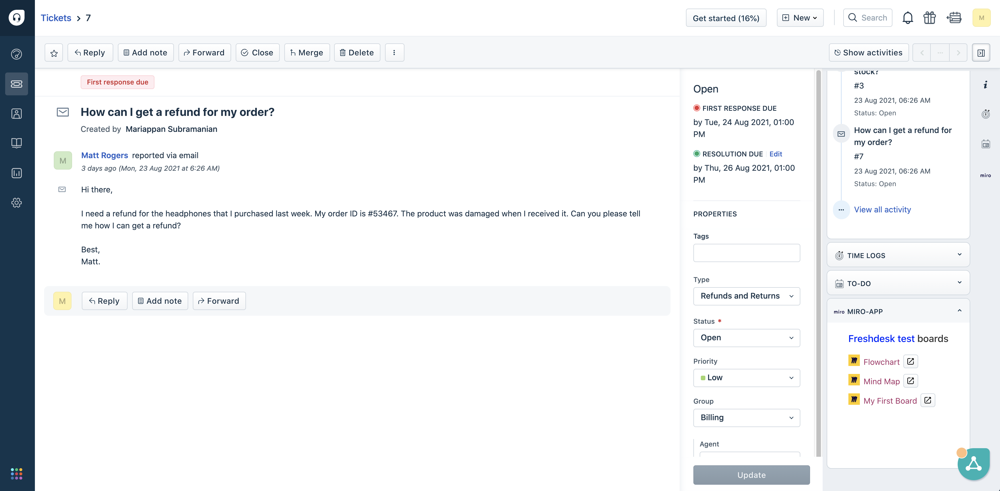
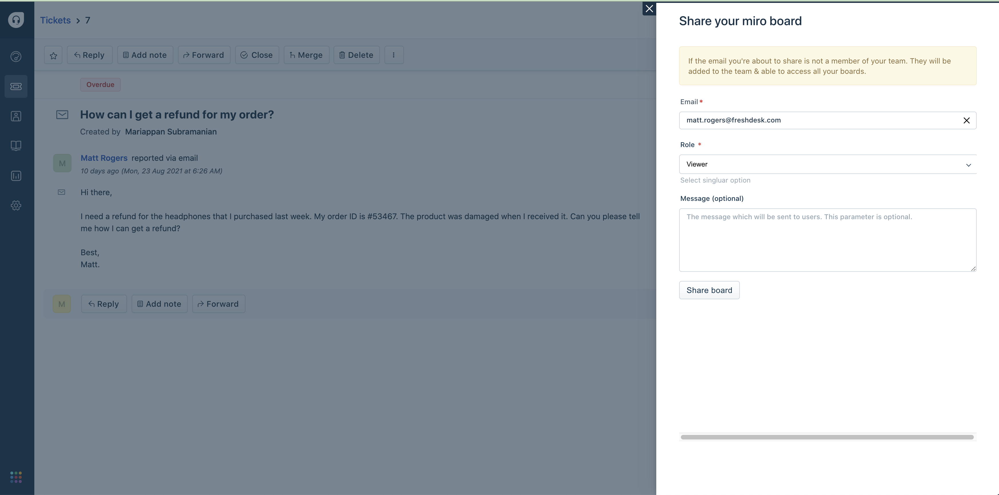
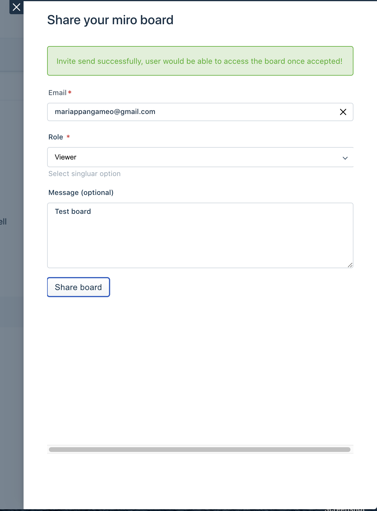
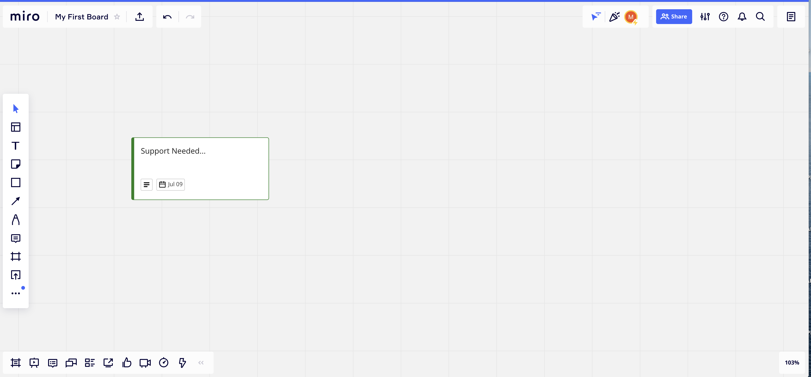

## Miro - Fresdesk integration

Miro is an online collaborative whiteboard platform to
bring teams together, anytime, anywhere.

- This app integrates a miro team of your choice with your Freshdesk account. 
- You can view all the availale boards in the ticket sidebar & share them instantly. 
- Whenever a new ticket is created, a serverless function runs at the background which create a new card with the ticket details

_Note:_ The board where new cards are being created is chosen by the user via a custom installation page during installation.

### <u>Prerequisites:</u>

- It is mandatory to have a Miro account.
- You must have an OAuth app registered in Miro - https://developers.miro.com/docs/getting-started#section-step-2-create-an-app-in-your-apps-settings

## Development Platform Features used in this app

| Feature | Purpose | 
| --- | --- | 
| App lifecycle methods | app.initialized(), app.activated() - To get the authorization details like configured teamID which can be used for further api calls |
| Data methods | To get ticket details, user details |
| Interface methods |  To open & close modal (board share modal) |
| Request methods | For api calls post, get |
| Instance methods | To get context inside modal - sharing data to-and-fro |
| Oauth | Authentication - connecting miro with freshdesk account | 
| Installation params | custom installation page (iparams.html is used) to collect which boards to sync with tickets | 
| Serveless - Product events  | (ticketCreated) used to create miro card widget whenever new ticket is created|

### <u>Steps to run the app locally</u>

- Clone the repo
- Run fdk run command
- Visit tickets page https://[accountnumber].freshdesk.com/a/tickets/ Remember to replace your account number.
- Choose any ticket and open it. Append the ?dev=true in the URL and press enter.
- You'll see an app as shown in App Demo

### <u>Screenshots</u>

1. List of boards displayed in ticket sidebar

2. Share board modal

3. Board share success state 

4. Created card widget in selected miro board

