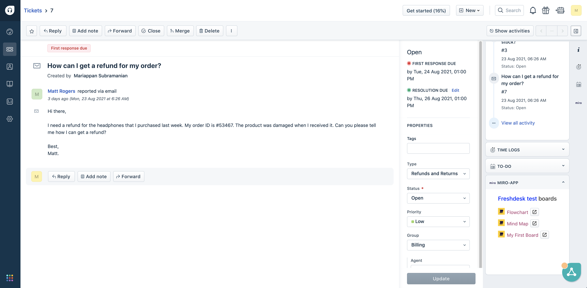
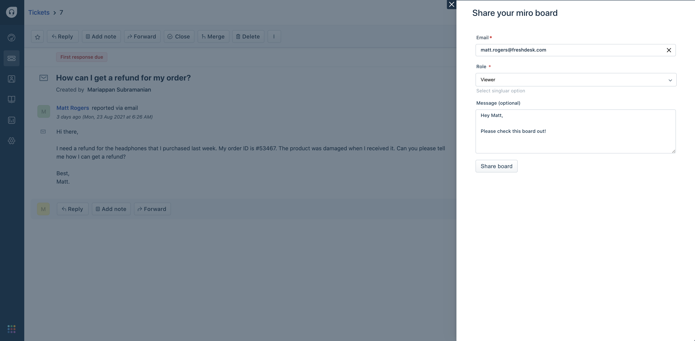

## Your First App

This app integrates your miro team with Freshdesk. You can view all the availale boards in the ticket sidebar & share them with the ticket requesters directly from your freshdesk app.

## Screenshots

## Prerequisites:

It is mandatory to have a Miro account.
You must have an OAuth app registered in Miro - https://developers.miro.com/docs/getting-started#section-step-2-create-an-app-in-your-apps-settings